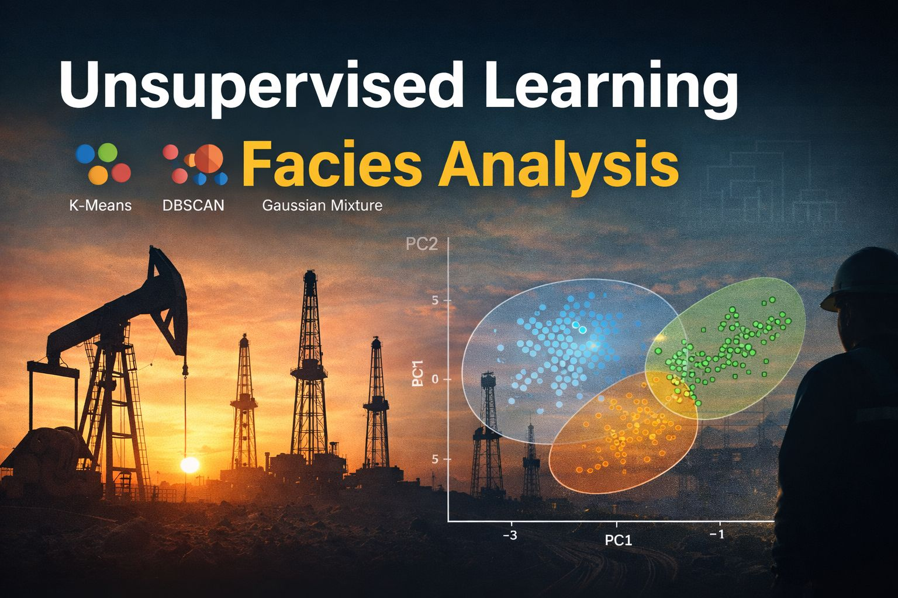

  

# 📊 UAS Analisis Data Kompleks Perminyakan
## Implementasi Unsupervised Machine Learning untuk Analisis Data Facies

Repository ini berisi tugas UAS yang membahas penerapan metode *Unsupervised Machine Learning* pada data perminyakan, khususnya untuk analisis dan pengelompokan (clustering) data facies reservoir.

Tujuan utama dari project ini adalah untuk memahami pola tersembunyi dalam data geologi menggunakan pendekatan data science.

---

## 📁 Isi Repository

| File | Keterangan |
|-----|------------|
| Model_Unsupervised_.ipynb | Notebook utama berisi proses analisis |
| facies_data2.csv | Dataset yang digunakan |
| README.md | Dokumentasi project |

---

## 🎯 Tujuan Analisis

Project ini saya buat untuk:

- Melakukan eksplorasi terhadap dataset facies  
- Menerapkan beberapa metode unsupervised learning  
- Membandingkan performa antar model  
- Melakukan visualisasi hasil clustering  
- Memberikan interpretasi terhadap hasil analisis  

---

## 🧠 Metode yang Digunakan

Beberapa metode yang diterapkan dalam analisis ini antara lain:

| Metode | Fungsi |
|------|-------|
| *K-Means Clustering* | Pengelompokan berbasis centroid |
| *DBSCAN* | Clustering berbasis kepadatan |
| *Gaussian Mixture Model (GMM)* | Clustering probabilistik |
| *PCA (Principal Component Analysis)* | Reduksi dimensi untuk visualisasi |

---

## 🔄 Alur Pengerjaan

Tahapan analisis dalam project ini meliputi:

1. Import dan pemeriksaan dataset  
2. Preprocessing data (scaling & normalisasi)  
3. Penerapan model clustering  
4. Evaluasi hasil clustering  
5. Perbandingan antar metode  
6. Visualisasi hasil menggunakan PCA  

---

## 📊 Hasil Analisis

- Setiap metode clustering menghasilkan pola yang berbeda  
- PCA membantu memvisualisasikan cluster dalam bentuk 2D  
- Evaluasi model dilakukan untuk menentukan metode yang paling sesuai dengan karakteristik data  

Pemilihan model terbaik didasarkan pada:

- Nilai evaluasi clustering  
- Konsistensi cluster  
- Kesesuaian dengan logika geologi
  
## 🛠 Cara Menjalankan Project

1. Clone repository ini:
git clone https://github.com/AlfathanHidayat/UAS-Analisis-Data-Kompleks-Perminyakan.git

2. Install library yang dibutuhkan : pip install pandas numpy matplotlib scikit-learn seaborn
3. Buka dan jalankan file notebook : Model_Unsupervised_.ipynb

## 📌 Kebutuhan Sistem
	•   Google Colab
	•	Library: pandas, numpy, matplotlib, scikit-learn

## 📝 Catatan

Project ini dibuat sebagai tugas mata kuliah Analisis Data Kompleks Perminyakan dengan fokus pada penerapan metode machine learning tanpa label (unsupervised learning).

## 👤 Penyusun

Nama: Alfathan Hidayat

Program Studi: Teknik Perminyakan

Institut Teknologi Sains Bandung
   

